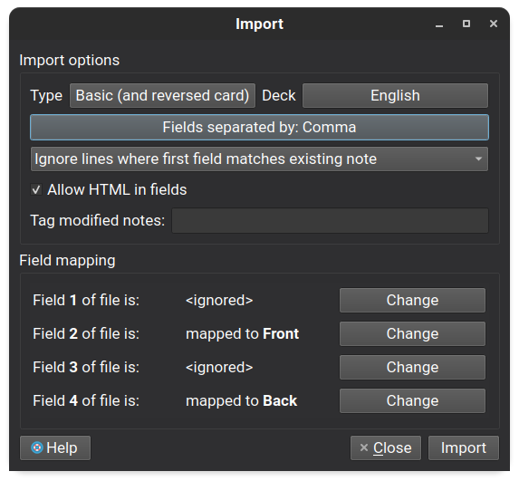

# Kindle Anki Converter

This collection of script allow users to convert the **vocabulary builder dataset from Kindle** into
a **Anki back and reverse cards deck**. 

# Currently Supported Features

- languages that are not English will fetch the translation to english and not their direct definition
- The API used in this project is Oxford Dictionary.
- Only the fields of definitions is supported.

# Tutorial

## Requirements

You need to have `python` installed. Run this to install the requirements
```
$ pip install -r requirements.txt
```

## API credentials

The definitions aren't included in the dataset from Kindle. Therefore, queries to a 3rd party
that contains lexical definitions for words is Required. The supported API is the one from Oxford Dictionary. 

1. To get your credentials, visit this website : "https://developer.oxforddictionaries.com/"
2. Click on **Get Your API Key**
3. Choose your pricing based on personal preference.
4. Fill in the form to complete your registration.
5. Check your email for confirmation (could be in spam folder)
6. Once you are registered, visit the [website](https://developer.oxforddictionaries.com/) again
7. Click on **Credentials**
8. You should see a table with your business app name on the far left. Click on it.
9. Write down your **Application ID** and one of your **Application Keys** somewhere.

## Locating `vocab.db`

1. Plug your Kindle on your computer.
2. Look for the file named `vocab.db` inside the storage of your Kindle. By default on `Ubuntu 20.04`, it should look something like this : `/media/<user>/Kindle/system/vocabulary/vocab.db`
3. Make note of where it is located (have it in a opened file finder somewhere)

## Running the scripts

1. Make sure you are at the root of this repo.
2. Create a directory that will store the data and dumps of the scripts
```
$ mkdir data
```
3. Simply run the script, provide the credentials as needed. 
```
$ python python main.py --appid <your app_id> --key <you app_key> --vocab <path_to_vocab.db>
```

### Future runs

After the first run, the script will save all of the argument so you need not provided them again in future runs. You can modify them by
either modifying `config.yaml` directly or providing them as an argument

```
$ python python main.py 
```

## Exporting to Anki

1. Open `data/vocab.csv` with Anki.
2. A window prompt should appear. Make sure that the card type and the field mapping should match as picture is shown. \

3. CLick **Import** and you should be done.
   
# Future Work

**TODO**
